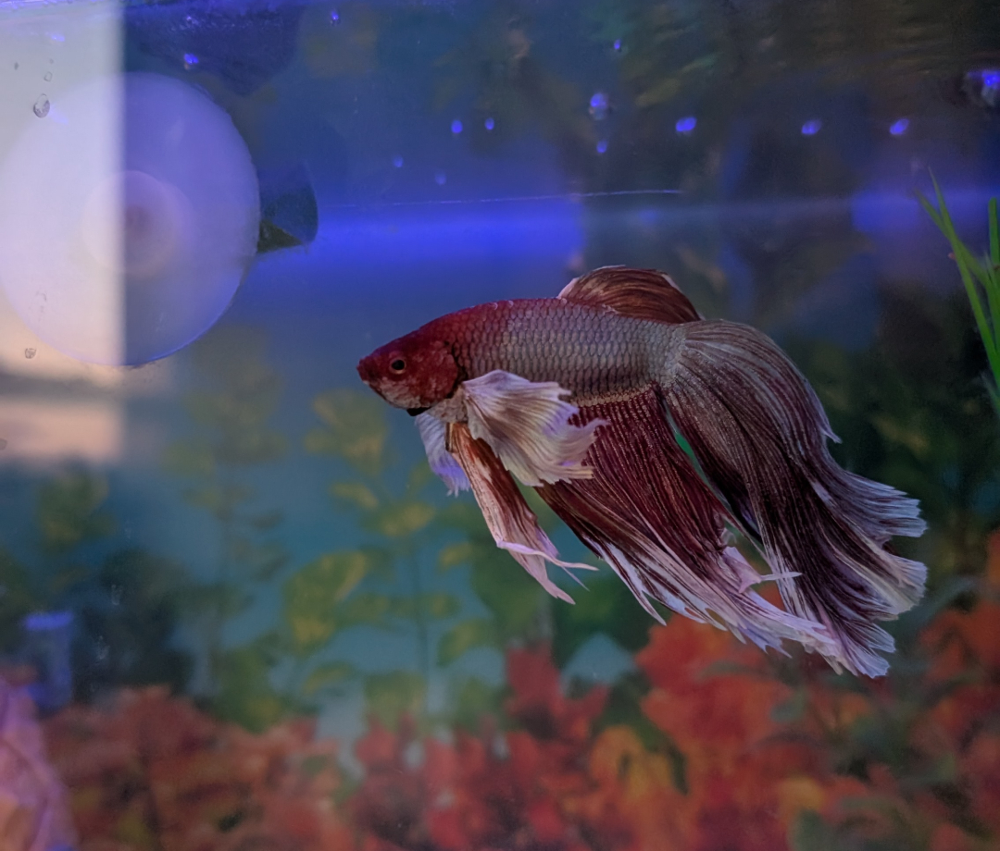

# FishFood: An automatic fish feeder

### Using my old Analog Discovery 2, a stepper motor, and a 3D printer, I am making a contraption to feed my fish while I'm gone.
#
This is Postgres Dumbo Malone, or Post Malone, or most commonly, PDM.

He's gotta be fed when my roomate and I aren't home so here I am.

